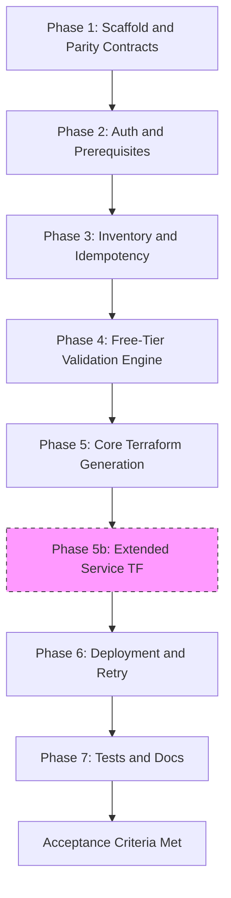
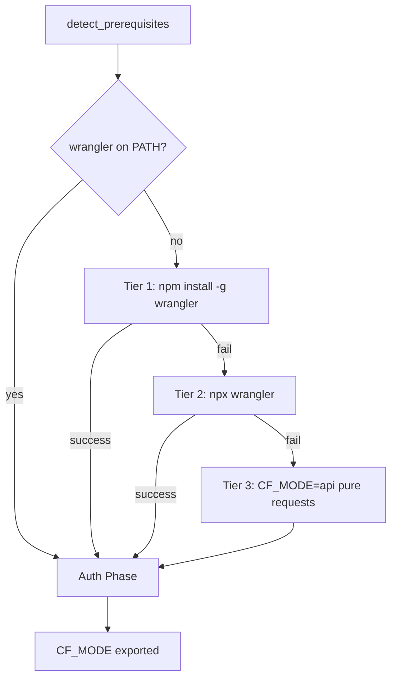

# Cloudflare Equivalent Plan (Parity with ./cloud/OCI and ./cloud/GCP)

> **Research baseline**: Cloudflare Workers Free / Free-plan limits sourced from
> official Cloudflare docs via `cloudflare-docs` MCP — last verified
> **2026-07-24 UTC**. All limits below are authoritative as of that date.

---

## Objective

Build `./cloud/Cloudflare` as a provider-specific equivalent of `./cloud/OCI`
(and structural peer of `./cloud/GCP`), preserving the same workflow shape:

- Inventory-first / idempotent execution
- Interactive + non-interactive operation
- Free-tier / Free-plan guardrails before deploy
- Terraform file generation and apply flow
- Tests, docs, and usage parity

### Conceptual adaptation (important)

Cloudflare is **not** traditional IaaS. There is no VPC / subnet / VM / SSH
baseline. The workflow *shape* stays identical (auth → inventory → free-tier
validate → generate Terraform → optional apply), but the **baseline maps to
edge/serverless free-plan primitives**: Workers (+ workers.dev), KV, R2, D1,
optional Durable Objects (SQLite), Queues, Pages, Workers AI, and DNS zone.



### Verification Sources (2026-07-24)

- Workers limits: https://developers.cloudflare.com/workers/platform/limits/
- Workers pricing / KV / D1 / Queues / R2 tables: https://developers.cloudflare.com/workers/platform/pricing/
- Durable Objects pricing: https://developers.cloudflare.com/durable-objects/platform/pricing/
- R2 pricing: https://developers.cloudflare.com/r2/pricing/
- Pages limits: https://developers.cloudflare.com/pages/platform/limits/
- Workers AI pricing: https://developers.cloudflare.com/workers-ai/platform/pricing/
- Queues free plan (2026-02-04): https://developers.cloudflare.com/changelog/post/2026-02-04-queues-free-plan/
- Terraform provider: https://registry.terraform.io/providers/cloudflare/cloudflare/latest/docs
- workers.dev routing: https://developers.cloudflare.com/workers/configuration/routing/workers-dev/

---

## Cloudflare Free Plan — Complete Authoritative Catalog

> Canonical source for shell constants, Python validator, and Terraform `check`
> blocks. Update all three when limits change.

### Compute / Runtime (Workers Free)

| Resource | Free Limit | Notes |
|---|---|---|
| **Workers requests** | 100,000 / day | Resets 00:00 UTC; Error 1027 when exceeded |
| **CPU time (HTTP)** | 10 ms / request | Paid allows up to 5 min (default 30 s) |
| **CPU time (Cron)** | 10 ms | Paid: 30 s / 15 min depending on interval |
| **Memory** | 128 MB | Same on Free and Paid |
| **Subrequests** | 50 / request | Paid: 10,000 / request |
| **Worker size** | 3 MB | Paid: 10 MB |
| **Number of Workers** | 100 / account | Paid: 500 |
| **Cron Triggers** | 5 / account | Paid: 250 |
| **workers.dev** | Included | Free-website treatment; personal/hobby |

### Storage

| Resource | Free Limit | Notes |
|---|---|---|
| **Workers KV — reads** | 100,000 / day | Resets 00:00 UTC |
| **Workers KV — writes** | 1,000 / day | |
| **Workers KV — deletes** | 1,000 / day | |
| **Workers KV — lists** | 1,000 / day | |
| **Workers KV — stored data** | 1 GB | |
| **R2 — storage** | 10 GB-month / month | Egress free |
| **R2 — Class A ops** | 1 million / month | Mutating ops |
| **R2 — Class B ops** | 10 million / month | Read ops |
| **D1 — rows read** | 5 million / day | |
| **D1 — rows written** | 100,000 / day | |
| **D1 — storage** | 5 GB total | Across all DBs |

### Durable Objects (Workers Free — SQLite backend only)

| Resource | Free Limit | Notes |
|---|---|---|
| **DO requests** | 100,000 / day | HTTP, RPC, WS messages, alarms |
| **DO duration** | 13,000 GB-s / day | Wall-clock while active |
| **DO SQL rows read** | 5 million / day | Matches D1 |
| **DO SQL rows written** | 100,000 / day | |
| **DO SQL stored data** | 5 GB total | Free plan not charged for storage overage (ops fail) |
| **KV-backed DO** | **Not on Free** | Requires Workers Paid |

### Messaging / Sites / AI

| Resource | Free Limit | Notes |
|---|---|---|
| **Queues** | 10,000 operations / day | Max retention 24 h on Free (vs 14 d Paid) |
| **Pages builds** | 500 / month · 1 concurrent | 20 min timeout |
| **Pages files / site** | 20,000 | Paid: 100,000 |
| **Pages projects** | 100 / account | |
| **Workers AI** | 10,000 Neurons / day | Exceed → upgrade to Paid or fail |

### Cost traps (block / warn by default)

| Resource | Status | Notes |
|---|---|---|
| **Workers Paid features** | Block | CPU > 10 ms, unbound duration, paid-only bindings |
| **R2 Infrequent Access** | Warn | Retrieval fees; prefer Standard on Free |
| **Load Balancers / Argo / Spectrum** | Block | Billable edge products |
| **KV-backed Durable Objects** | Block | Requires Workers Paid |
| **Containers** | Block | Billed runtime; Workers Paid |

---

## OCI / GCP ↔ Cloudflare Service Mapping

| Category | OCI | GCP | Cloudflare Equivalent | Notes |
|---|---|---|---|---|
| **Compute** | VM A1 / E2.Micro | e2-micro | **Workers** (100k req/day) | No VM/SSH — edge functions |
| **Object storage** | Object Storage 10 GB | GCS 5 GB | **R2** 10 GB | Egress free on R2 |
| **Block / disk** | Block Volume 200 GB | PD 30 GB | N/A (stateless) | Use R2 / D1 / DO storage |
| **Networking** | VCN + subnet + IGW | VPC + subnet + FW | **DNS zone + workers.dev / routes** | No VPC equivalent |
| **NoSQL / KV** | Autonomous JSON | Firestore | **Workers KV** | Daily ops caps |
| **SQL** | Autonomous DB | — | **D1** | SQLite serverless |
| **Stateful coord** | — | — | **Durable Objects (SQLite)** | Free since Apr 2025 |
| **Queues** | Streaming | Pub/Sub | **Queues** | Free since Feb 2026 |
| **Static / PaaS** | — | App Engine / Cloud Run | **Pages** / Workers Assets | |
| **Functions** | OCI Functions | Cloud Functions / Run | **Workers** | Primary compute |
| **AI** | — | Vision / NLP APIs | **Workers AI** | Neurons/day |
| **Secrets** | Vault | Secret Manager | Worker secrets / API token | TF uses `CLOUDFLARE_API_TOKEN` |

---

## Hard-Coded Free-Tier Constants (source of truth)

```bash
# ── Workers ────────────────────────────────────────────────────────────────
CF_FREE_WORKERS_REQUESTS_PER_DAY=100000
CF_FREE_WORKERS_CPU_MS=10
CF_FREE_WORKERS_MEMORY_MB=128
CF_FREE_WORKERS_SUBREQUESTS=50
CF_FREE_WORKERS_SIZE_MB=3
CF_FREE_WORKERS_COUNT=100
CF_FREE_CRON_TRIGGERS=5

# ── KV ─────────────────────────────────────────────────────────────────────
CF_FREE_KV_READS_PER_DAY=100000
CF_FREE_KV_WRITES_PER_DAY=1000
CF_FREE_KV_DELETES_PER_DAY=1000
CF_FREE_KV_LISTS_PER_DAY=1000
CF_FREE_KV_STORAGE_GB=1

# ── R2 ─────────────────────────────────────────────────────────────────────
CF_FREE_R2_STORAGE_GB=10
CF_FREE_R2_CLASS_A_OPS_PER_MONTH=1000000
CF_FREE_R2_CLASS_B_OPS_PER_MONTH=10000000

# ── D1 ─────────────────────────────────────────────────────────────────────
CF_FREE_D1_ROWS_READ_PER_DAY=5000000
CF_FREE_D1_ROWS_WRITTEN_PER_DAY=100000
CF_FREE_D1_STORAGE_GB=5

# ── Durable Objects ────────────────────────────────────────────────────────
CF_FREE_DO_REQUESTS_PER_DAY=100000
CF_FREE_DO_DURATION_GB_S_PER_DAY=13000
CF_FREE_DO_SQL_STORAGE_GB=5
CF_FREE_DO_BACKEND="sqlite"          # kv backend requires Paid

# ── Queues / Pages / AI ────────────────────────────────────────────────────
CF_FREE_QUEUES_OPS_PER_DAY=10000
CF_FREE_PAGES_BUILDS_PER_MONTH=500
CF_FREE_PAGES_FILES_PER_SITE=20000
CF_FREE_PAGES_PROJECTS=100
CF_FREE_WORKERS_AI_NEURONS_PER_DAY=10000

# ── Budget guards ──────────────────────────────────────────────────────────
CF_COST_WARN_R2_INFREQUENT_ACCESS=true
CF_COST_BLOCK_WORKERS_PAID_FEATURES=true
CF_COST_BLOCK_LOAD_BALANCER=true
CF_COST_BLOCK_KV_BACKED_DO=true
```

---

## Constraints & Design Rules

- Keep command and UX semantics aligned with OCI/GCP where possible.
- Replace IaaS auth/inventory with Cloudflare-native mechanisms (API token + Account ID).
- Enforce only Workers Free / Free-plan constraints with explicit constants/checks.
- Prefer deterministic defaults (`workers.dev`, Standard R2, SQLite DO).
- **wrangler-optional design**: wrangler is the preferred CLI/UX layer; pure
  `requests` + Cloudflare REST API is the guaranteed fallback (`CF_MODE=wrangler|api`).
- **Budget guard**: warn or block anything that bills (Paid Workers features,
  R2 IA, LBs) unless `CLOUDFLARE_ALLOW_PAID_RESOURCES=true`.
- Platform-agnostic installation of wrangler (npm) + Terraform; non-interactive.

---

## What OCI/GCP Do Well (Port These Patterns)

- Inventory-first + idempotency
- Dual guardrails (orchestrator + Terraform `check` blocks)
- Non-interactive env-var contract
- Retry/backoff for transient API errors
- Command wrappers with timeouts
- Safe JSON handling
- Backups before overwriting generated `.tf`
- Strict renderer parity tests (2-space indent)
- Config reload from prior `variables.tf`

---

## Cloudflare-Specific Differences

| Topic | OCI/GCP | Cloudflare | Impact |
|---|---|---|---|
| **Auth** | ADC / API keys / session | `CLOUDFLARE_API_TOKEN` + `CLOUDFLARE_ACCOUNT_ID` | Token scopes must cover Workers/R2/D1/KV/DNS |
| **Baseline** | Network + VM + SSH | Worker + KV + R2 + D1 (+ optional DO/Queues/Pages) | No SSH keys / cloud-init |
| **Free units** | Hours / GB-months | Daily request & op caps | Inventory should surface usage headroom when API allows |
| **CLI** | oci / gcloud | wrangler (preferred) + REST | Dual-path like GCP's gcloud-optional |
| **Terraform provider** | hashicorp/oci, hashicorp/google | `cloudflare/cloudflare` ~> 5 | Pin major v5 |
| **Capacity errors** | Out of capacity / ZONE_EXHAUSTED | Rate limits, 429, Error 1027 | Retry regex for CF API |

---

## Scope for Iteration 1

### Mandatory (Core Parity)

- Folder scaffold under `./cloud/Cloudflare`
- Bash + PowerShell setup scripts
- Python CLI in `src/cloudbooter/`
- Terraform: `provider.tf`, `variables.tf`, `main.tf` (+ optional per-service files)
- Free-tier constants (bash + Python frozen dataclass + TF checks)
- Docs: `README.md`, `USAGE.md`, `QUICKSTART.md`, `FREE_TIER_LIMITS.md`, `OVERVIEW.md`
- Tests: renderers, free-tier, integration, e2e

### Optional Extensions (Phase 2)

- `pages.tf`, `queues.tf`, `durable_objects.tf`, `dns.tf`, `workers_ai.tf`

---

## Work Plan

### Phase 1 — Scaffold & Parity Contracts

1. Create `cloud/Cloudflare/` mirroring GCP layout.
2. Env-var contract:
   - Cloudflare-specific: `CLOUDFLARE_API_TOKEN`, `CLOUDFLARE_ACCOUNT_ID`,
     `CLOUDFLARE_ZONE_ID`, `CLOUDFLARE_ZONE_NAME`, `CLOUDFLARE_WORKER_NAME`,
     `CLOUDFLARE_ALLOW_PAID_RESOURCES`, `CF_MODE`
   - Shared: `NON_INTERACTIVE`, `AUTO_USE_EXISTING`, `AUTO_DEPLOY`, `SKIP_CONFIG`,
     `DEBUG`, `FORCE_REAUTH`, `RETRY_MAX_ATTEMPTS`, `RETRY_BASE_DELAY`

### Phase 2 — Authentication & Prerequisites



Auth priority: `CLOUDFLARE_API_TOKEN` → wrangler OAuth login (interactive) → fail if `NON_INTERACTIVE`.

### Phase 3 — Inventory

Discover Workers, KV namespaces, R2 buckets, D1 databases, Queues, Pages projects, zones.

### Phase 4 — Free-Tier Validation

Reject/warn on Paid-only features; enforce worker count / DO backend / R2 storage class.

### Phase 5 — Core Terraform Generation

Always-generated:

1. `cloudflare_workers_script` + `cloudflare_workers_script_subdomain` (workers.dev)
2. `cloudflare_workers_kv_namespace`
3. `cloudflare_r2_bucket` (Standard)
4. `cloudflare_d1_database`

Provider pin: `cloudflare/cloudflare` `~> 5`.

### Phase 6 — Deploy & Retry

`terraform init` → `plan` → `apply` with retry on 429 / rate limit / transient 5xx.

### Phase 7 — Tests & Docs

Same suite shape as GCP.

---

## Acceptance Criteria

- Interactive / non-interactive paths generate valid Terraform for Free-plan baseline.
- `NON_INTERACTIVE=true` completes dry-run with no prompts.
- Re-running does not invent conflicting resource names without `AUTO_USE_EXISTING`.
- Paid-only configs blocked unless `CLOUDFLARE_ALLOW_PAID_RESOURCES=true`.
- Renderer unit tests pass; `terraform validate` passes when terraform available.
- `FREE_TIER_LIMITS.md` matches verified catalog (2026-07-24).

---

## Open Decisions — Resolved

| Decision | Resolution |
|---|---|
| Strict policy mode | Block Paid features; override via `CLOUDFLARE_ALLOW_PAID_RESOURCES=true` |
| Auth baseline | API token (+ account id); wrangler OAuth for interactive |
| Terraform provider | `cloudflare/cloudflare` ~> 5 |
| DO default | SQLite-backed only on Free; block KV-backed DO |
| DNS zone | Optional; not required for workers.dev baseline |
| Pages / Queues / AI | Optional Phase 2 files; constants documented |

---

## Official Documentation Reference

> Verified 2026-07-24 via Cloudflare docs MCP + Terraform Registry.

### Free Tier & Pricing

- https://developers.cloudflare.com/workers/platform/limits/
- https://developers.cloudflare.com/workers/platform/pricing/
- https://developers.cloudflare.com/durable-objects/platform/pricing/
- https://developers.cloudflare.com/r2/pricing/
- https://developers.cloudflare.com/d1/platform/pricing/
- https://developers.cloudflare.com/kv/platform/pricing/
- https://developers.cloudflare.com/queues/platform/pricing/
- https://developers.cloudflare.com/pages/platform/limits/
- https://developers.cloudflare.com/workers-ai/platform/pricing/
- https://developers.cloudflare.com/changelog/post/2026-02-04-queues-free-plan/
- https://developers.cloudflare.com/changelog/post/2025-04-07-durable-objects-free-tier/

### Auth & API

- https://developers.cloudflare.com/fundamentals/api/get-started/create-token/
- https://developers.cloudflare.com/fundamentals/api/reference/

### Wrangler

- https://developers.cloudflare.com/workers/wrangler/
- https://developers.cloudflare.com/workers/wrangler/install-and-update/
- https://developers.cloudflare.com/workers/wrangler/commands/
- https://developers.cloudflare.com/workers/wrangler/configuration/

### Terraform

- https://registry.terraform.io/providers/cloudflare/cloudflare/latest/docs
- https://registry.terraform.io/providers/cloudflare/cloudflare/latest/docs/resources/workers_script
- https://registry.terraform.io/providers/cloudflare/cloudflare/latest/docs/resources/workers_kv_namespace
- https://registry.terraform.io/providers/cloudflare/cloudflare/latest/docs/resources/r2_bucket
- https://registry.terraform.io/providers/cloudflare/cloudflare/latest/docs/resources/d1_database
- https://registry.terraform.io/providers/cloudflare/cloudflare/latest/docs/resources/workers_script_subdomain
- https://developers.cloudflare.com/terraform/

### Product Concepts

- https://developers.cloudflare.com/workers/
- https://developers.cloudflare.com/workers/configuration/routing/workers-dev/
- https://developers.cloudflare.com/r2/
- https://developers.cloudflare.com/d1/
- https://developers.cloudflare.com/kv/
- https://developers.cloudflare.com/durable-objects/
- https://developers.cloudflare.com/queues/
- https://developers.cloudflare.com/pages/
- https://developers.cloudflare.com/workers-ai/
