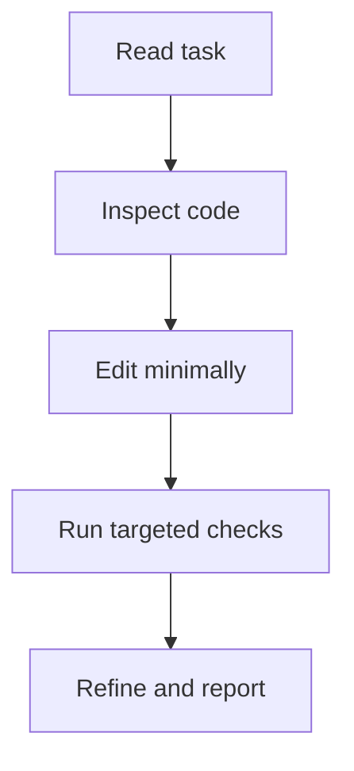

# Project conventions

## Code

- Prefer clear names over abbreviations.
- Keep functions focused.
- Match the style already used in the file you touch.
- Avoid unrelated refactors while fixing a specific task.

## Docs and plans

- Every new or updated planning / design document needs at least one Mermaid `flowchart TD` near the top (after the objective).
- Keep diagrams in sync when the written steps change.
- For multi-phase plans, one top-level diagram is enough; add focused diagrams only when they help.

## Providers

- Follow the OCI module layout when adding a provider under `cloud/<PROVIDER>/`.
- Keep free-tier validation next to the configuration decisions that use it.
- Keep generated Terraform filenames consistent with the existing workflow.

## Change discipline

- Prefer the smallest meaningful diff.
- Update docs when user-visible behavior changes.
- Add or adjust tests when behavior changes.

## Working loop

