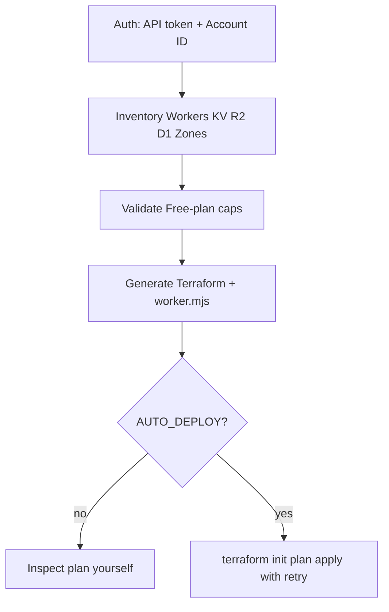

# Cloudflare overview

How the Cloudflare path works.

## Why this differs from OCI / GCP

There is no free-tier VM, VPC, or SSH baseline. CloudBooter keeps the same workflow and maps the default to Workers Free-plan primitives instead.

## Modes

| `CF_MODE` | Behavior |
|---|---|
| `wrangler` | Preferred CLI for interactive login / local DX |
| `npx` | Run Wrangler without a global install |
| `api` | Pure `requests` against the Cloudflare REST API |

Terraform talks to the API with your token. It does not need Wrangler.

## Guardrails

1. Preflight in Bash / PowerShell and Python `validate_proposed_config()`
2. Terraform `check` blocks (CPU ≤ 10 ms, R2 Standard, block load balancers and other paid-only paths)

## Retry

Rate limits and transient 429 / 503 style failures are retried with exponential backoff (`RETRY_MAX_ATTEMPTS`, `RETRY_BASE_DELAY`).

See [FREE_TIER_LIMITS.md](FREE_TIER_LIMITS.md) and [../USAGE.md](../USAGE.md).
