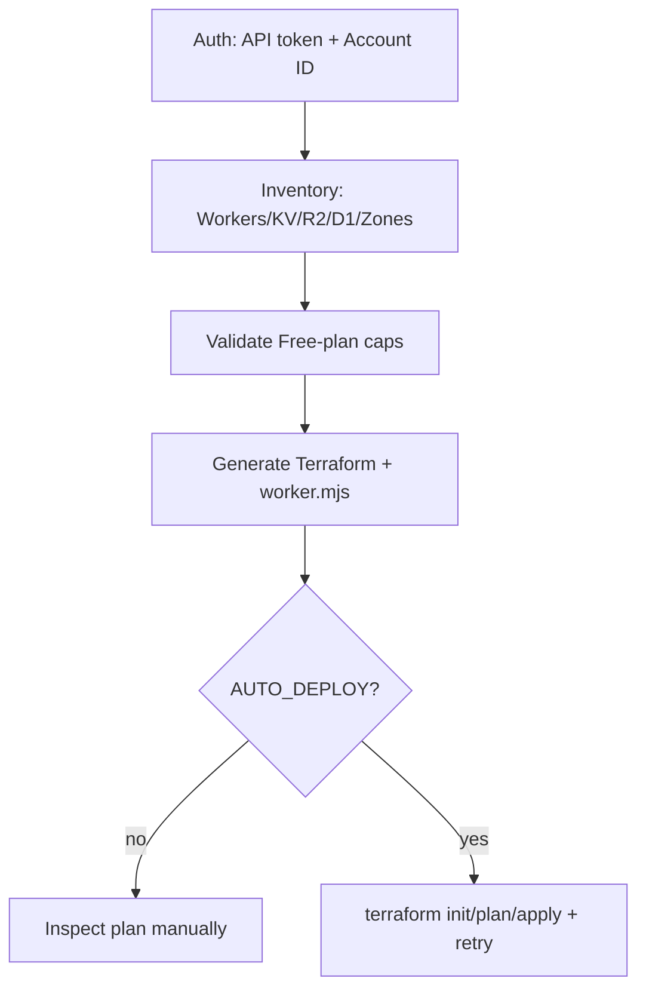

# Cloudflare Provider Overview

## Why Cloudflare differs from OCI/GCP

Cloudflare has no free-tier VM, VPC, or SSH baseline. CloudBooter keeps the same **workflow** (inventory → validate → generate → apply) but maps the baseline to edge primitives that exist on the Workers Free plan.

## Modes

| `CF_MODE` | Behavior |
|---|---|
| `wrangler` | Preferred CLI for interactive login / local DX |
| `npx` | Run wrangler without global install |
| `api` | Pure `requests` against Cloudflare REST API |

Terraform never requires wrangler — it uses the API token directly.

## Dual guardrails

1. Preflight in Bash/PowerShell + Python `validate_proposed_config()`
2. Terraform `check` blocks in `variables.tf` (CPU ≤ 10 ms, R2 Standard, DO sqlite, no LB)

## Retry

Transient Cloudflare API / Terraform failures matching rate-limit / 429 / 503 patterns are retried with exponential backoff (`RETRY_MAX_ATTEMPTS`, `RETRY_BASE_DELAY`).
