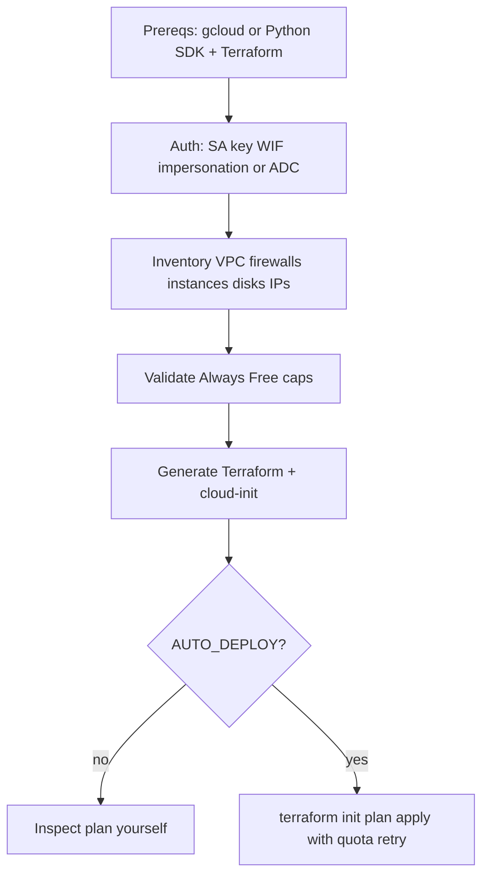

# GCP overview

How the Google Cloud path works.

## Why this exists

Picking a free-eligible region, machine type, and disk size by hand is easy to get wrong. CloudBooter inventories the project, rejects plans that break Always Free caps, and writes ordinary Terraform.

## Layers

| Layer | Role |
|---|---|
| `setup_gcp_terraform.sh` | Primary Bash orchestrator |
| `setup_gcp_terraform.ps1` | Windows equivalent |
| `src/cloudbooter/` | Renderers, auth, inventory, validation, Click CLI |
| Generated `.tf` files | Written at run time |

## Auth order

1. Service account or WIF file via `GCP_CREDENTIALS_FILE`
2. Impersonation (`GCP_IMPERSONATE_SA` in scripts, `GCP_IMPERSONATE_SERVICE_ACCOUNT` in the Python CLI)
3. Application Default Credentials

## Modes

| `GCP_MODE` | Behavior |
|---|---|
| `gcloud` (default) | Uses the `gcloud` CLI |
| `python` | Uses the Google Python SDKs — no `gcloud` required |

The Bash script switches to `python` if it cannot install the SDK.

## Design choices

- Safe to re-run: inventory first, prefer existing resources when asked
- Free-tier checks in shell, Python, and Terraform
- No committed `.tf` files in git
- Retries on quota / capacity style errors
- Warns about reserved-but-unattached static IPs and other cost traps

See [FREE_TIER_LIMITS.md](FREE_TIER_LIMITS.md) and [../USAGE.md](../USAGE.md).
