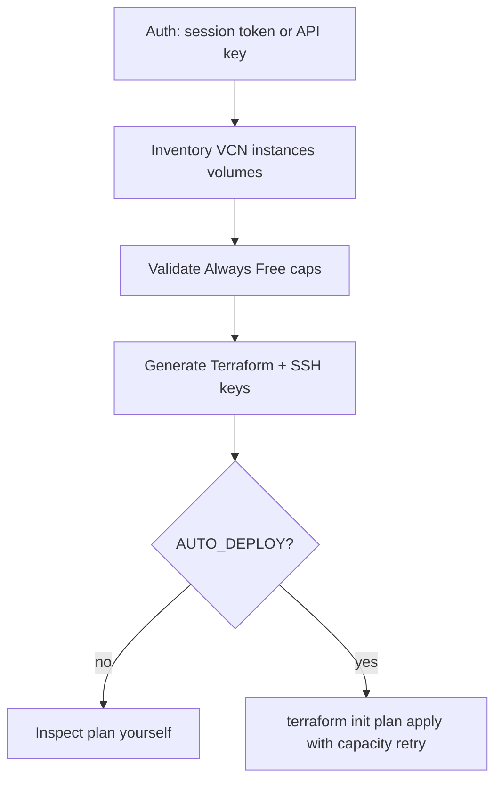

# OCI overview

How the Oracle Cloud path in CloudBooter fits together.

## What this provider is for

OCI has a useful Always Free tier, but the console is easy to overshoot — especially after the June 2026 A1 cut to 2 OCPU / 12 GB, and especially on PAYG accounts. CloudBooter inventories first, prefers a billing-safe default, and writes Terraform instead of hiding the cloud behind a black box.

## Layers

| Piece | Role |
|---|---|
| `setup_oci_terraform.sh` / `.ps1` | Main orchestrators |
| `src/cloudbooter/` | Free-tier constants, Python CLI (`audit`, Bitwarden resize helpers) |
| `bw_oci_resize_all.sh` | Multi-account legacy ARM resize via Bitwarden |
| Generated `.tf` files | Written at run time; not committed |

## Auth

Interactive runs usually use browser session tokens (`oci session authenticate`). Non-interactive / multi-account flows use API keys from the environment or Bitwarden custom fields. Instance principal is available when you run on an OCI compute instance.

## Guardrails

Free-tier numbers live in three places on purpose:

1. Bash / PowerShell constants in the setup scripts
2. `src/cloudbooter/free_tier.py`
3. Terraform `check` blocks in generated `variables.tf`

`ENFORCE_LIMITS=auto` turns enforcement on for PAYG tenancies. Set `true` to always enforce, `false` only if you know why you are bypassing it.

## Capacity retries

Always Free shapes often return "Out of Capacity". Apply is wrapped in exponential backoff (`RETRY_MAX_ATTEMPTS`, `RETRY_BASE_DELAY`). That is intentional, not a hang.

## More reading

- [QUICKSTART.md](QUICKSTART.md) — first successful run
- [FREE_TIER_LIMITS.md](FREE_TIER_LIMITS.md) — numbers, PAYG, resize
- [../USAGE.md](../USAGE.md) — env vars and Bitwarden flow
