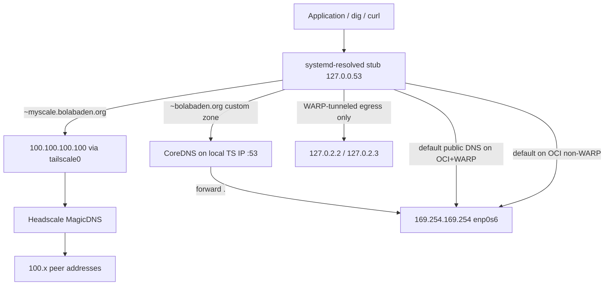
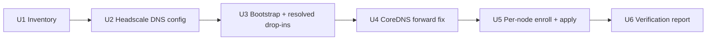

# fix: Restore Tailscale mesh health and unified split DNS

**Target repo:** bolabaden-infra (implementation). This plan document lives in cloudbooter for session tracking.

## Summary

Audit every Headscale/Tailscale node, restore working `tailscale status` and control-plane enrollment, then standardize split DNS so MagicDNS resolves `*.myscale.bolabaden.org` while default public resolution on OCI uses the link-local Oracle resolver (`169.254.169.254` on OCI `enp0s6`); WARP DNS applies only to tunneled egress paths, not as the default public resolver on OCI+WARP hosts. Remediate WARP and legacy CoreDNS configurations that currently override or conflict with that model.

## Problem Frame

The bolabaden mesh uses Headscale at `headscale.bolabaden.org` with MagicDNS base domain `myscale.bolabaden.org`. Live investigation (Jul 2026) shows:

| Symptom | Affected nodes | Root cause (inferred) |
|---------|----------------|----------------------|
| `tailscale status` shows self **offline** or **NoState / logged out** | micklethefickle, vractormania, local dev | Stale enrollment, control-plane TLS/key errors, or `tailscale logout` |
| Wrong MagicDNS suffix (`~bodecloud.com`) | micklethefickle | Legacy tailnet registration; CoreDNS still serves `bodecloud.com` zone |
| Global DNS pushed to Cloudflare `127.0.2.2/127.0.2.3` (WARP) or `1.1.1.1` (Headscale config) | OCI VPS nodes with WARP | Competes with Oracle VCN DNS and MagicDNS |
| CoreDNS forwards public queries to `1.1.1.1` | micklethefickle (and beatapostapita) | Corefile root forward block not using Oracle resolver |
| Bootstrap re-breaks DNS on reprovision | All cloud-init nodes | `cloud-init-bootstrap.sh` sets public resolvers then `tailscale up --accept-dns=true --reset` |
| Many peers offline 166–218 days | cloudserver1–3, mobile, WSL | Out of scope for active remediation unless user wants full fleet revival |

vractormania is **logged out** (`unexpected state: NoState`, last error `404 Not Found` on control key). micklethefickle shows peers with correct `.myscale.` suffix but self offline and local dev reports `x509: certificate signed by unknown authority` for Headscale TLS.

---

## Requirements

- R1. Every **in-scope production node** runs `tailscale status` without error and shows self registered under Headscale with a DNS name ending in `.myscale.bolabaden.org`.
- R2. From any in-scope node, `resolvectl query <peer>.myscale.bolabaden.org` returns the peer's tailnet IP.
- R3. On OCI nodes, default-route public name resolution (e.g. `google.com`) uses Oracle VCN DNS `169.254.169.254` on `enp0s6` — not WARP catch-all DNS or Headscale global upstream alone. WARP DNS may still apply to explicitly tunneled egress paths (see KTD2 / OQ2).
- R4. WARP-enabled nodes retain WARP egress without capturing tailnet traffic (`100.64.0.0/10` excluded) or breaking mesh SSH.
- R5. Headscale MagicDNS config, CoreDNS zones, systemd-resolved drop-ins, and bootstrap scripts agree on `myscale.bolabaden.org` as the sole mesh suffix.
- R6. A repeatable verification script/report proves R1–R3 per node after remediation.
- R7. Changes are codified in bolabaden-infra so reprovision does not regress DNS.

### In-scope production nodes (initial remediation set)

| Node | Role | OCI | WARP | Notes |
|------|------|-----|------|-------|
| beatapostapita | Headscale server host, full-stack | TBD on audit | Likely | Headscale + CoreDNS containers |
| micklethefickle | Nomad/mesh leader | TBD on audit | Yes | CoreDNS on TS IP; wrong `~bodecloud.com` |
| vractormania | OCI failover VPS | Yes | Unknown | Logged out — re-enroll first |
| hardballin | Active peer | TBD on audit | Unknown | Online via direct path — verify only unless U1 audit fails |

### In scope if desired (non-production)

| Node | Role | Notes |
|------|------|-------|
| Local dev | Developer workstation | TLS trust fix + myscale drop-in only (no Oracle); see OQ3 |

### Deferred unless expanded (OQ1)

| Node | Role | OCI | Notes |
|------|------|-----|-------|
| cloudserver1–3 | OCI VPS | Yes | Long offline (166+ days) — skip unless reachable via SSH |

**Out of scope (unless explicitly expanded):** Stale mobile/WSL peers offline 166+ days, OCI instance resize, browser-based Oracle login.

---

## Key Technical Decisions

- KTD1. **systemd-resolved is the host DNS authority** on Linux mesh nodes. Tailscale joins with `--accept-dns=false` on OCI and WARP node classes so Headscale does not overwrite `/etc/resolv.conf` directly. (see origin: knowledgebase WARP+Tailscale split-DNS runbook)
- KTD2. **Split routing via drop-ins** under `/etc/systemd/resolved.conf.d/`:
  - `tailscale-myscale.conf`: `Domains=~myscale.bolabaden.org`, `DNS=100.100.100.100`
  - `oci-vcn.conf` (OCI only): default route DNS on `enp0s6` uses `169.254.169.254`; optional `Domains=~*.oraclevcn.com`
  - `warp-split.conf` (WARP-only nodes without OCI default route): scoped WARP egress domains only — not `Domains=~.` on OCI+WARP hosts (OQ2 default: Oracle `169.254.169.254` owns default public resolution; WARP DNS for tunneled egress paths only)
- KTD3. **Headscale global nameservers** change from Cloudflare `1.1.1.1` to **empty or OCI link-local** in `compose/docker-compose.headscale.yml`, because clients use `--accept-dns=false` and local split DNS owns public resolution. Split map may add `bolabaden.org` → CoreDNS tailnet IP where custom zones are required.
- KTD4. **CoreDNS remains supplemental**, not a MagicDNS replacement: bind only on the node's tailnet IP (current pattern on micklethefickle); serve `bolabaden.org` / legacy `bodecloud.com` file zones; **forward `.` to `169.254.169.254` on OCI** instead of `1.1.1.1`. Deprecate `bodecloud.com` zone after nodes re-enroll under `myscale`.
- KTD5. **Enrollment before DNS surgery**: nodes in `NoState` or logged out must re-authenticate to Headscale (preauth key) before DNS changes — vractormania is blocked on this today.
- KTD6. **No browser/HTTPS Oracle login** for any step in this plan (user constraint from prior session).

---

## High-Level Technical Design

### DNS resolution stack (target state, OCI + WARP node)

### Remediation sequence

Units U2–U4 codify policy in bolabaden-infra (compose, bootstrap templates, Corefile). Per-node application in U5 follows KTD5: re-enroll broken nodes before applying DNS drop-ins or CoreDNS changes on that host.

---

## Scope Boundaries

### In scope

- Mesh inventory and health audit script
- Headscale DNS/MagicDNS configuration in compose and deployed full-stack
- systemd-resolved drop-in templates and cloud-init bootstrap fixes
- CoreDNS Corefile forward/upstream alignment with Oracle resolver
- Re-enrollment of vractormania, micklethefickle self-offline, and local dev (if desired)
- Verification harness and runbook update

### Deferred for later

- Reviving all stale peers (mobile, WSL, cloudserver1–3) unless user expands scope
- Headscale HA / SQLite replication
- Nomad job parity beyond headscale DNS block mirror

### Deferred to Follow-Up Work

- OCI vractormania instance resize (separate cloudbooter track; blocked on API credentials)
- Replacing live `full-stack.yml` on beatapostapita via full compose regen vs surgical edit (implementation chooses least risky)

### Outside this product's identity

- Browser-based Oracle Cloud authentication flows

---

## System-Wide Impact

- **Operators:** Must have Headscale preauth keys and SSH via public IP before `tailscale up --reset` on any node.
- **beatapostapita:** Headscale container restart after DNS config change; brief control-plane blip.
- **WARP nodes:** Incorrect exclusion routes risk SSH lockout — validate `warp-cli add-excluded-route 100.64.0.0/10` on every WARP host.
- **Docker workloads:** Apps resolving mesh names may need explicit `dns: [100.100.100.100]` in compose if not using host network.
- **Automation:** `infra/tailscale.go` and paas mesh tests assume working `tailscale status --json`.

---

## Risks and Dependencies

| Risk | Mitigation |
|------|------------|
| SSH lockout during `--reset` | Require confirmed public-IP SSH; never reset without fallback |
| WARP captures tailnet traffic | Exclude `100.64.0.0/10`; verify ping to peer TS IP with WARP connected |
| Port 53 conflict (CoreDNS vs WARP vs resolved) | CoreDNS binds tailnet IP only; no host-wide `:53` on WARP nodes |
| Headscale TLS trust on dev machines | Install CA or use correct Traefik cert chain for `headscale.bolabaden.org` |
| vractormania 404 on control key | Delete stale node in Headscale UI/CLI, re-enroll with fresh preauth key |
| full-stack.yml drift from compose fragment | Regenerate or patch both; document which is source of truth |

**Dependencies:** Headscale admin access, SSH to in-scope nodes, preauth keys, bolabaden-infra repo write access.

---

## Implementation Units

### U1. Mesh inventory and health baseline

**Goal:** Produce authoritative per-node report before any mutations.

**Requirements:** R1

**Dependencies:** None

**Files:**
- `infra/scripts/mesh-dns-audit.sh` (create)
- `infra/scripts/verify.sh` (extend if present)

**Approach:** SSH (or local exec) each in-scope host; capture `tailscale status`, `tailscale status --json` (Self.Online, DNSName), `resolvectl status`, `cat /etc/resolv.conf`, WARP state, Oracle link DNS on `enp0s6`, CoreDNS container presence. Output JSON/markdown matrix.

**Patterns to follow:** `infra/tailscale.go` node priority map; paas test fixtures for hostnames.

**Test scenarios:**
- Happy path: script runs against localhost stub with mocked outputs → valid JSON schema
- Edge case: SSH timeout to offline host → row marked unreachable, script exits 0 with partial report
- Error path: missing `tailscale` binary → row flagged `no-client`

**Verification:** Report lists all in-scope nodes with enrollment state, DNS domains, and upstream resolvers.

---

### U2. Headscale control-plane DNS policy

**Goal:** Align Headscale-advertised DNS with split-DNS model.

**Requirements:** R5, R7

**Dependencies:** U1

**Files:**
- `compose/docker-compose.headscale.yml`
- `full-stack.yml` (headscale-config embedded section)
- `nomad/jobs/nomad.headscale.hcl` (mirror DNS block)

**Approach:**
- Set `dns.nameservers.global` to `[]` or `[169.254.169.254]` with comment that clients use `--accept-dns=false`
- Keep `magic_dns: true`, `base_domain: myscale.bolabaden.org` (or `myscale.$DOMAIN`)
- Keep `override_local_dns: false`
- Optionally populate `dns.nameservers.split` for `bolabaden.org` pointing to CoreDNS tailnet IP on nodes that run it (defer exact IPs to U1 report)
- Redeploy headscale-server on beatapostapita; verify `headscale dns` / API reflects changes

**Patterns to follow:** Existing DNS block comments in compose headscale config (~L207–280).

**Test scenarios:**
- Happy path: `docker compose config` validates headscale fragment after edit
- Integration: after deploy, newly enrolled node receives MagicDNS base domain `myscale.bolabaden.org` in netmap (inspect via `tailscale debug prefs` or Headscale API)

**Verification:** Headscale DNS config matches KTD3; no Cloudflare global upstream unless explicitly retained for non-OCI node class.

---

### U3. systemd-resolved drop-ins and bootstrap fix

**Goal:** Codify split DNS so cloud-init and manual enrollments stay consistent.

**Requirements:** R3, R4, R5, R7

**Dependencies:** U2

**Files:**
- `compose/configs/systemd-resolved/tailscale-myscale.conf` (create)
- `compose/configs/systemd-resolved/oci-vcn.conf` (create)
- `compose/configs/systemd-resolved/warp-split.conf` (create)
- `cloud-init-bootstrap.sh`
- `knowledgebase/operations/mesh-dns-runbook.md` (document operational steps; U6 owns creation)

**Approach:**
- Add three drop-in templates installed by bootstrap based on `OCI_INSTANCE=true` / `WARP_ENABLED=true` env flags
- Ensure `/etc/resolv.conf` → `/run/systemd/resolve/stub-resolv.conf`
- Change Tailscale join to `--accept-dns=false` for OCI and WARP profiles; keep `--login-server=https://headscale.${DOMAIN}`
- Remove blanket Cloudflare `custom.conf` as sole DNS policy; replace with conditional drop-ins
- Document WARP route exclusion for `100.64.0.0/10`

**Patterns to follow:** knowledgebase `installing-cloudflare-warp-on-linux-vps` split-DNS recipe; `garden.io/k8s-ha-config/configure-tailscale-k3s.sh` (`--accept-dns=false`).

**Test scenarios:**
- Happy path: rendered drop-in files contain correct `Domains=~myscale.bolabaden.org` and OCI `169.254.169.254`
- Edge case: non-OCI node skips `oci-vcn.conf`
- Integration: bootstrap dry-run on VM — after enroll, `resolvectl query google.com` uses Oracle on OCI stub

**Verification:** Re-running bootstrap on test node yields KTD2 split without Tailscale overwriting resolv.conf.

---

### U4. CoreDNS upstream alignment

**Goal:** CoreDNS forwards public DNS to Oracle resolver on OCI; zones align with mesh naming.

**Requirements:** R3, R5

**Dependencies:** U1, U3

**Files:**
- `compose/configs/coredns/Corefile.tmpl` (create — vendored from live `my-media-stack/volumes/coredns/Corefile`; generator script `scripts/render-coredns-zone.py` exists on nodes only today, not in repo)
- `compose/docker-compose.coredns.yml` (create or extend if coredns service is added to compose)
- Runtime on nodes: `my-media-stack/volumes/coredns/Corefile` (deploy from repo template)

**Approach:**
- Change root `forward .` from `1.1.1.1 8.8.8.8` to `169.254.169.254` on OCI nodes (parameterize by env)
- Keep `bind` on tailnet IP only (not `0.0.0.0`)
- Plan deprecation of `bodecloud.com` zone after U5 re-enrollment
- Ensure `bolabaden.org` zone records remain for Traefik failover URLs (`svc.<peer>.bolabaden.org` pattern in Corefile header comment)

**Patterns to follow:** Existing micklethefickle Corefile structure (`.:53` + zone blocks).

**Test scenarios:**
- Happy path: `dig @<ts-ip> google.com` on OCI node returns answer (forward via Oracle)
- Edge case: CoreDNS reload without port 53 conflict on host stub
- Error path: Oracle metadata DNS unreachable → logged error; fallback policy documented (optional single public resolver as last resort — defer to implementation)

**Verification:** CoreDNS container health check passes; mesh zone queries still resolve from tailnet IP.

---

### U5. Per-node enrollment and DNS apply

**Goal:** Restore working tailscale on broken nodes and apply U3/U4 policy.

**Requirements:** R1, R2, R4

**Dependencies:** U2, U3, U4

**Files:**
- Runtime only (no new files); optional `infra/scripts/mesh-node-remediate.sh` wrapper

**Approach (ordered):**

1. **vractormania:** Headscale delete stale node if duplicate; `tailscale up --login-server=https://headscale.bolabaden.org --authkey=... --accept-dns=false --hostname=vractormania`; apply OCI drop-ins; verify online
2. **micklethefickle:** Delete stale `bodecloud.com` registration if present; `--reset` + re-enroll; apply WARP+myscale drop-ins (add `oci-vcn.conf` only if U1 audit marks `OCI_INSTANCE=true`); restart CoreDNS with new Corefile
3. **beatapostapita:** After U1 audit, apply `tailscale-myscale.conf` + `oci-vcn.conf` if OCI; add `warp-split.conf` only if WARP egress without OCI default route; confirm headscale-server healthy post-U2
4. **Local dev:** Fix Headscale TLS trust (`x509 unknown authority`); login; `--accept-dns=false` + myscale drop-in only (no Oracle)
5. **cloudserver1–3 / others:** Only if U1 report marks them reachable — same OCI template

**Execution note:** Confirm public SSH before any `tailscale logout` or `--reset`.

**Test scenarios:**
- Happy path: after remediate, `tailscale status` shows self online with `*.myscale.bolabaden.org`
- Integration: `ping beatapostapita.myscale.bolabaden.org` from vractormania succeeds
- Error path: control plane unreachable — abort DNS changes, fix Traefik/TLS first

**Verification:** U1 audit re-run shows all targeted nodes passing R1–R3.

---

### U6. Verification harness and documentation

**Goal:** Prevent regression; give operators a single command to validate mesh DNS.

**Requirements:** R6, R7

**Dependencies:** U5

**Files:**
- `infra/scripts/mesh-dns-verify.sh` (create)
- `knowledgebase/operations/mesh-dns-runbook.md` (create)
- `infra/tailscale.go` (optional: wire verify script into health checks)

**Approach:** Script accepts node list; for each host checks: `tailscale status` self online, `resolvectl query` for fixed peer set, public query uses Oracle on OCI, WARP exclusion present. Exit non-zero on failure; JSON output for automation.

**Test scenarios:**
- Happy path: all in-scope nodes green → exit 0
- Edge case: one node fail → exit 1 with failed check detail
- Integration: run from CI stub (mock SSH) — documents expected interface

**Verification:** Runbook documents node classes, rollback (restore drop-ins backup), and canonical test hostnames.

---

## Open Questions

- OQ1. Should **cloudserver1–3** be revived in this pass or left offline? (Default: skip unless reachable via SSH.)
- OQ2. On WARP nodes, should **public** DNS go through WARP (`127.0.2.2`) or Oracle (`169.254.169.254`) when both are present? **Default adopted:** Oracle for default-route public resolution on OCI; WARP DNS only for tunneled egress paths (reflected in KTD2).
- OQ3. Is **local dev machine** in the mandatory verification set? (Default: yes for enrollment/TLS fix, no Oracle drop-in.)

---

## Acceptance Examples

- AE1. From vractormania after remediation: `tailscale status` shows self **online**; `resolvectl query beatapostapita.myscale.bolabaden.org` returns `100.111.132.16`.
- AE2. From micklethefickle: `resolvectl query google.com` uses DNS server `169.254.169.254` on `enp0s6` (not only WARP stub).
- AE3. From any in-scope OCI node: `dig @169.254.169.254 google.com +short` succeeds and matches `resolvectl query google.com` answer.
- AE4. Re-run `infra/scripts/mesh-dns-verify.sh` → all in-scope nodes pass.

---

## Sources and Research

- Live SSH audit: vractormania, beatapostapita, micklethefickle (Jul 2026)
- `bolabaden-infra/compose/docker-compose.headscale.yml` — MagicDNS config
- `bolabaden-infra/cloud-init-bootstrap.sh` — conflicting `--accept-dns=true`
- `bolabaden-infra/knowledgebase/.../installing-cloudflare-warp-on-linux-vps` — split DNS pattern
- `bolabaden-infra/knowledgebase/.../docker-dns-vs-coredns-integration` — prefer MagicDNS over host CoreDNS for mesh names
- micklethefickle runtime Corefile at `my-media-stack/volumes/coredns/Corefile` — forward to 1.1.1.1 (to fix)
